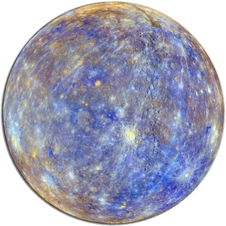

{: width="318" height"319" align="right" style="border:0;background:transparent" }

# Planet Mercury

_Mercury_ is intended a replacement for Sam Ruby's [Planet Venus](https://github.com/rubys/venus/).

A _planet_ is a kind of feed aggregator. It takes a list of newsfeeds (Atom, RSS, &c.), splices them together, and spits a set of HTML pages and/or a feed.

## Quickstart

If you have the Go toolchain already configured, you can `go install` the binary:

```console
go install github.com/kgaughan/mercury/cmd/@latest
```

By default, _mercury_ will look for look for a file called _mercury.toml_ in the current directory. This feed is in [TOML][] format, but the key thing you need to know is that keys and values are separated with an `=`, string values must be quoted, and `[[feed]]` introduces new feed configuration.

If you want to use an explicitly named configuration file, you can pass this with the `--config` flag.

Here is an example file:

```toml
name = "My Planet!"
url = "https://example.com/"
owner = "Jane Doe"
email = "jane.doe@example.com"
cache = "./cache"
timeout = "20s"
theme = "./theme"
output = "./output"
items = 10
max_pages = 2

[[feed]]
name = "Keith Gaughan"
feed = "https://keith.gaughan.ie/feeds/all.xml"

[[feed]]
name = "Inklings"
feed = "https://talideon.com/inklings/feed"
```

See [the configuration details](configuration.md) for more details on the meaning of each field.

Then run:

```console
mercury
```

This will fetch all the feeds to the cache directory and write the site to the output directory.

[TOML]: https://en.wikipedia.org/wiki/TOML

## Command line

The `--help` flag will show you the help information:

```console
$ ./mercury --help
mercury - Generates an aggregated site from a set of feeds.

Flags:
  -c, --config string   path to configuration (default "./mercury.toml")
  -h, --help            show help
  -B, --no-build        don't build anything
  -F, --no-fetch        don't fetch, just use what's in the cache
  -V, --version         print version and exit
```

Usually, the default behaviour is what you want: mercury will try to intelligently fetch any feeds and regenerate the site. Use `--no-build` if you just want to prime the cache but don't want to generate the site. Use `--no-fetch` if you want to regenerate the site without fetching any feeds. This can be useful if you're testing out a new theme.
